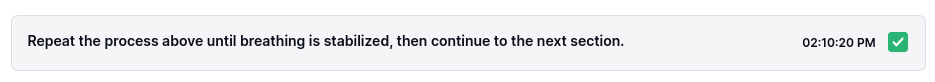
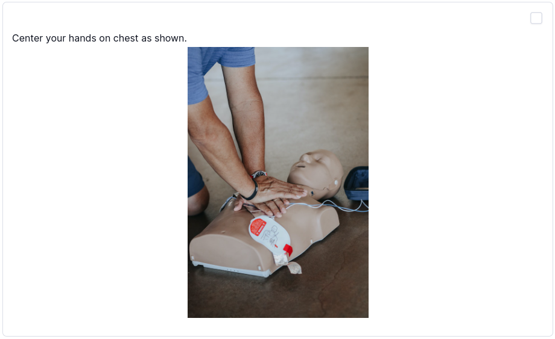
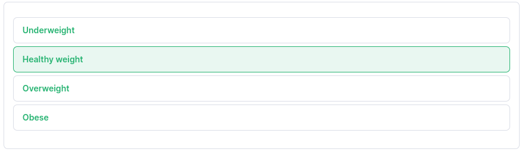
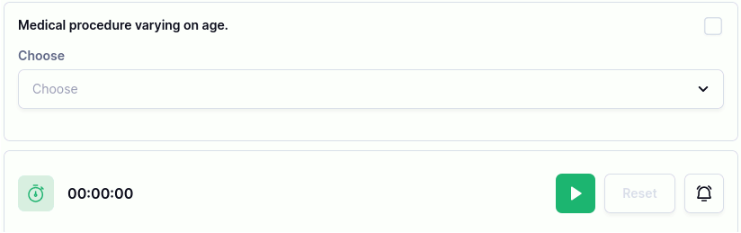
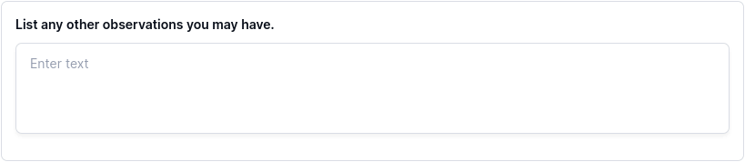

## Text only 
Store information in plain text. Useful for instructions or to provide additional information.

## Text/Media Box 
Use the text/media box If you need more advanced information displayed, such as tables, text styling, and even videos.

## Dropdown Selector 
If you want the user to record a multiple-choice selection.

### Customizations
- Multiple selection: allow the user to choose more than one selection.

## Dropdown Data 
Display a text/media box based on what category is selected.

### Customizations
- Category title: The dropdown option that the user can select.
- Category data:  The text and media that will appear when the particular option is selected.
Choose `Add category` to add additional options.

## Input Text 
If the user needs to input plain text themselves, use the input text item.
