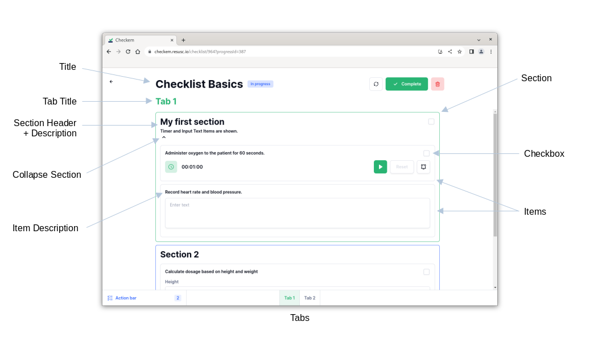

This section covers everything you need to know about checklists, including the structure of a checklist, the items it contains, and the variety of customization options you have.

## Title
The Checklist title is displayed at the top of a checklist. This is how your checklist will appear from other parts of the Checkem application. Click the title to edit it.

## Items
Items are the basic building blocks of checklists. They represent a singular component, such as a stopwatch, calculator, or burn chart. A checklist is composed of many of these items arranged in an order that is useful to the medical administrator.

### Item Customizations
The following options are available to all items (there are additional customizations for each item type):

- Description: Include a modifiable description at the top of the item.
- Checkbox: Include a checkbox at the top right of an item. Users will be able to "check off" the item during use to signify that they have completed it. Records timestamp when checked.
- Make Collapsable: Include a caret for showing / hiding item. Choose 'Start as Collapsed' if you'd like the item to start as hidden when a checklist is opened.

## Sections
Each section contains one or more items. Group items in sections to keep your checklist organized and easy to navigate.

### Section Customizations
- Header text: Include a modifiable title at the top of the section.
- Make Collapsable: Include a caret for showing / hiding section. Choose 'Start as Collapsed' if you'd like the section to start as hidden when a checklist is opened.
- Description text: Include a modifiable description at the top of the section.
- Checkbox: Include a checkbox at the top right of an section. Users will be able to "check off" the section during use to signify that they have completed it. Records timestamp when checked.
- Color: Outline color for the section.

## Tabs
Tabs are a way to separate sections / items on different pages. Checklist tabs work like browser tabs or sheets within a spreadsheet workbook. A tab's title is visible directly under the checklist title.

Edit a tab's title by clicking on it. Additional options such as duplicating or deleting a tab are available from the tab's kebab icon at the bottom of the Checklist builder. To add more tabs, click the plus icon at the bottom.

### PDF protocols
PDF protocols can be added to checklists as tabs. This is useful if a medical procedure cannot be represented with checklist items, or if you'd like a reference guide to tab to while administering a Checklist.