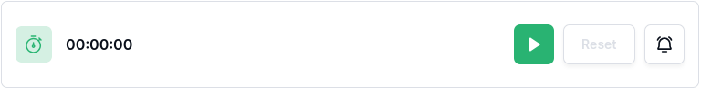
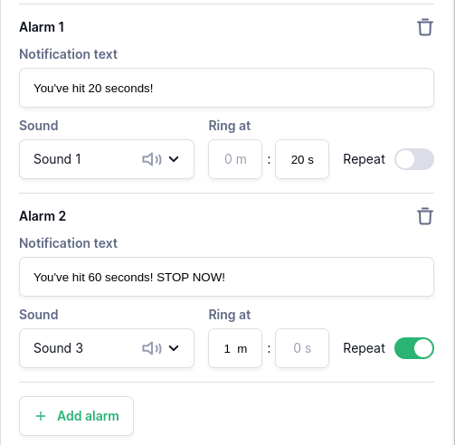

## Stopwatch 
Simple stopwatch capable of recording duration, start time, and end time. Option to notify user at certain durations.

### Customizations
- Record time at beginning and end of stopwatch: Show timestamp when stopwatch is started/stopped. Resuming/pausing will reset end time.

#### Alarms
Add alarms to notify the user when a specific duration has passed. Choose from multiple sounds, and set `Ring at` to the desired duration. Choose `Repeat` if you'd like the alarm to loop indefinitely.

Users can click the bell icon on the stopwatch item to silence alarms. 

