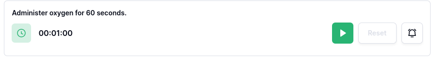
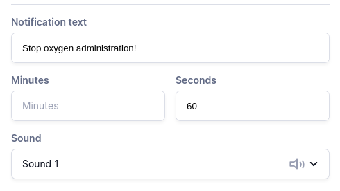
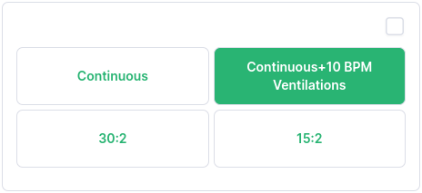
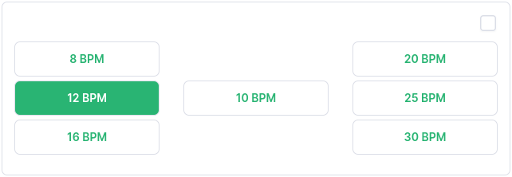

## Stopwatch 
Simple stopwatch capable of recording duration, start time, and end time. Option to notify user at certain durations.

### Customizations
- Record time at beginning and end of stopwatch: Show timestamp when stopwatch is started/stopped. Resuming/pausing will reset end time.

#### Alarms
Add alarms to notify the user when a specific duration has passed. Choose from multiple sounds, and set `Ring at` to the desired duration. Choose `Repeat` if you'd like the alarm to loop indefinitely.

Users can click the bell icon on the stopwatch item to silence alarms. 

## Timer 
Countdown timer capable of recording start and end time. User is notified when time is up.

### Customizations
- Record time at beginning and end of stopwatch: Show timestamp when stopwatch is started/stopped.
- Notification text: Text that will be displayed when time is up.
- Minutes / Seconds: Duration of timer.
- Sound: Choose from 5 alarm sounds.

Users can click the bell icon on the timer item to silence the alarm. 

## Time Marker 
Button which records the current time when clicked. Can do this repeatedly.

Use the undo  to remove the latest marked time, or click `Reset` to remove all marked times.

### Customizations
Button text: Change the button text. Default is `Mark Time`.

## Metronome 
Metronome for keeping pace. When button is pressed, audio is emitted at the desired rate.
There are 2 configurations for the Metronome app:

- CPR: *Continuous, Continuous+10 BPM Ventilations, 30:2, 15:2*
- Ventilations: *8, 10, 12, 16, 20, 25, and 30 beats per minute*

| CPR | Ventilations |
| --- | --- |
|  | 