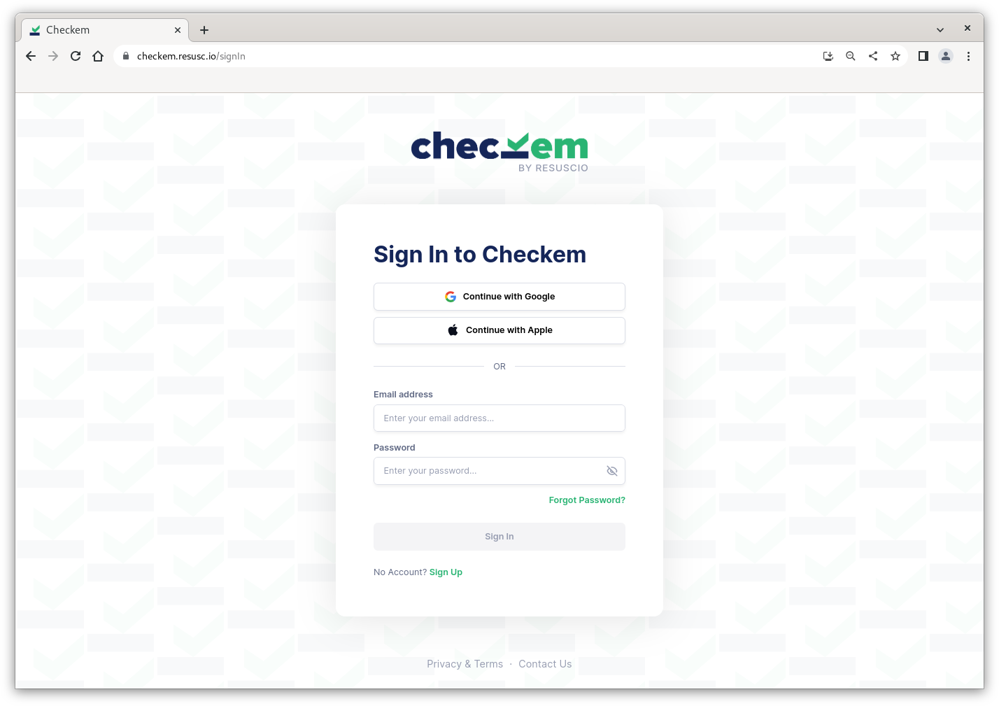
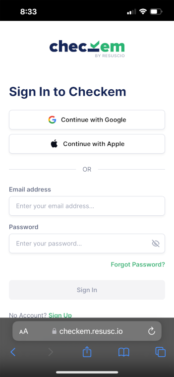
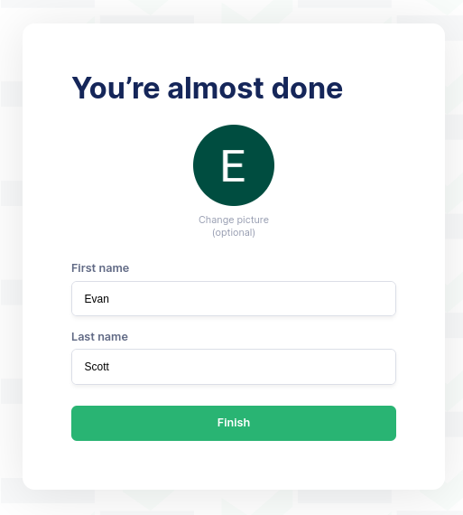

# Accessing Checkem

## Checkem Web
It's pretty easy to get Checkem up and running. Simply navigate to [https://checkem.resusc.io/](https://checkem.resusc.io/) in any modern web browser.

Checkem is mobile-friendly and adapts well to use on any tablet or mobile device:

|Computer|Mobile|
| ----------- | ----------- |
|||

### Checkem for iOS / Android (coming soon)

Checkem will be available in native apps for iOS and Android devices *starting later this year*. In the meantime, you can still use Checkem from the web on these devices.

## Creating an Account

Creating an account is free [^1] and fast. Sign in with your Google Account, Apple ID, or create your own account with an email address.
Once your account is created, you will be prompted to enter a name and upload an optional profile pic. TODO will be able to see this name on the Checkem platform.

*If your organization has already provided you with a login, please use that instead.*

[^1]: You will need to be part of an organization to access most Checkem features. There is a cost associated with organizations. See TODO for more information.