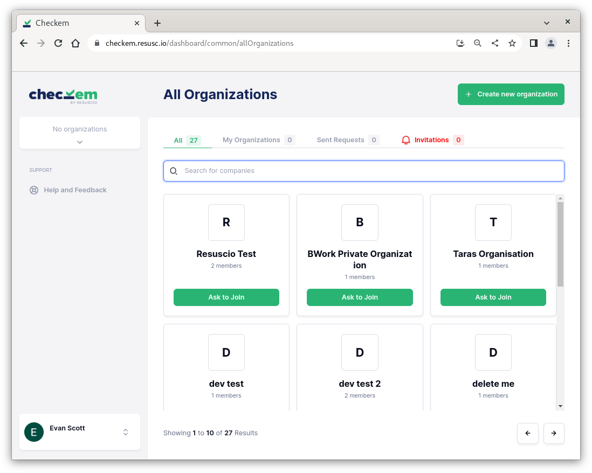
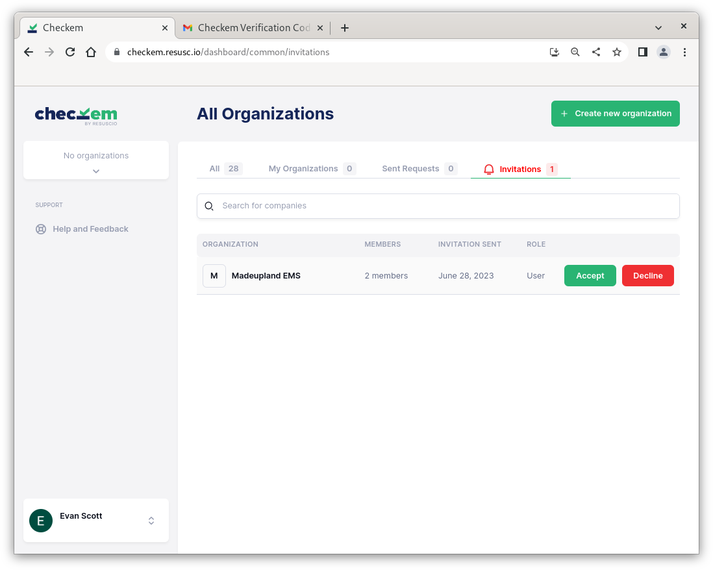
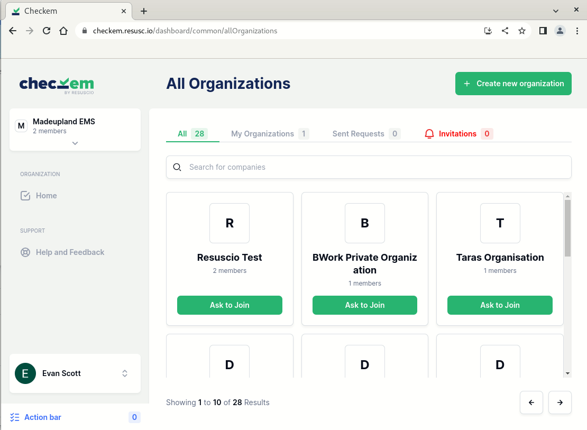

## Joining your first organization

Organizations tie your experencience of Checkem together with others. If you are an end user, your organization probably consists of fellow EMS agency members, medical administrators, or students at your university.

Checkem Checklists are created by organization administrators and are available to all users belonging to that organization.

*Looking to create your own organization? see TODO*.

When you first login to Checkem, you will be presented with a homepage displaying various organizations available for you to join. Use the search bar to find your organization, or scroll through the pages to locate it manually.

Clicking `Ask to Join` will send a request to the organization's administrators. Once they accept, you will be able to view the contents of the organization.

Clicking the Invitations tab will display any Organizations that you have been invited to:

## Joining additional organizations

Checkem gives you the option of joining more that one organization. Click on your org in the top left and select `Show All Organizations`:
