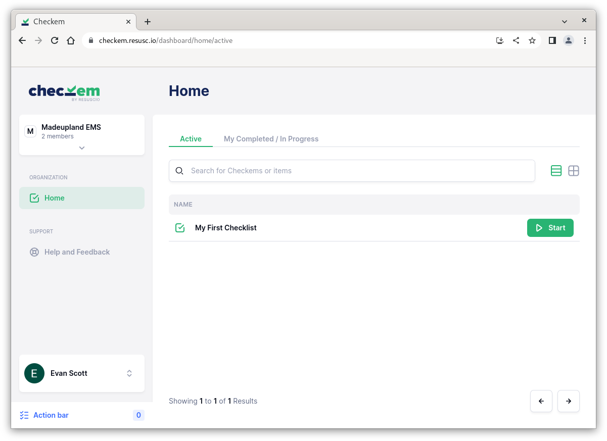
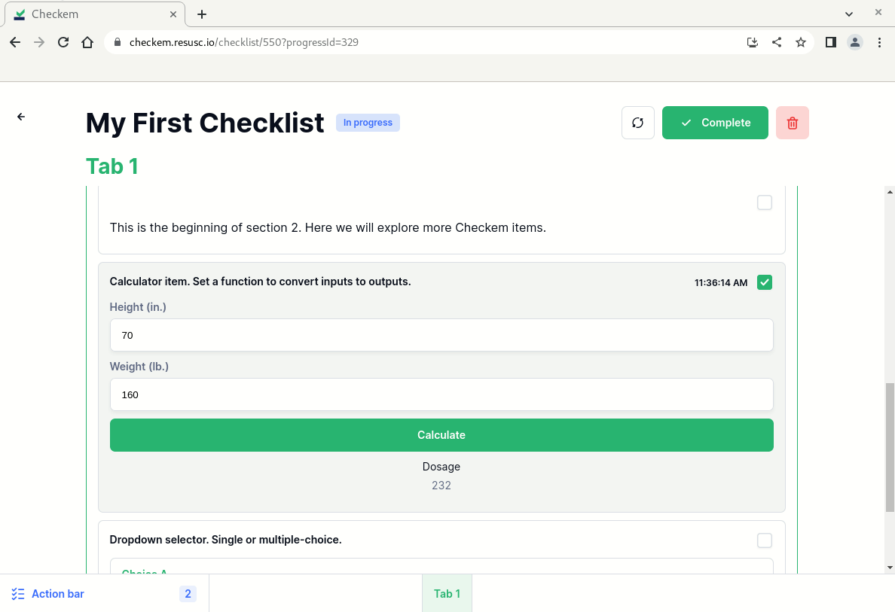
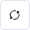
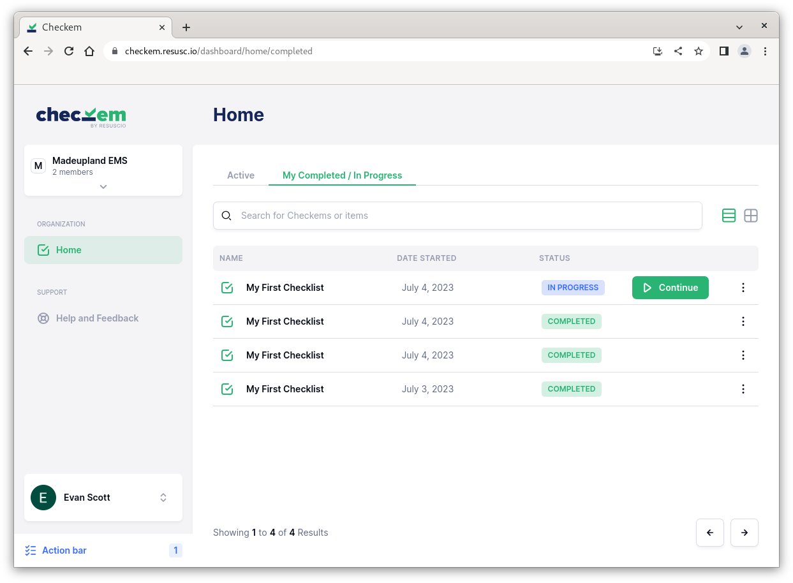

Checklists are what make Checkem so powerful. They represent customizable EMS protocols to be used within your organization.
Checklists consolidate necesary medical tools (stopwatches, metronomes, dosage calculators, etc.) into a standardized workflow used to complete a medical procedure.

*Having these tools available and arranged in easily digestable steps for your most time-critical medical prodecures has the potential to improve patient outcomes and potentially save lives.*

You can think of Checkem as a cookbook, and checklists as its recipies. The magic of Checkem is that each organization has full control over what goes into these recepies!

We will cover Checklist items and creating your own checklists later in this documentation. For now, here are some basics.

## The Home page

The homepage contains checklist that your organization has made available to you. Search or tab through the pages to locate a checklist of your choice.

When you are ready to use a checklist, press `Start` to launch it.

## Navigating a Checklist
Checklists are served to the user as a form-like page. Scroll up and down to navigate through the checklist. In the case that a checklist has more than one tab, you can toggle between them on the bottom.

A well designed checklist should include consise, descriptive steps and present the necessary tools to you in order that they would be used in a medical procedure.

As you scroll through a Checklist, you will be able to interact with the items. *Changes that you make to a Checklist while using it will not affect other runs of that Checklist, instead, they will be saved in the __My Completed / In Progress__ section.*

If at any point you would like to reset your changes completely, click . If you'd instead like to discard a Checklist run completely, click . *Note: you will not be able to undo this action!*

When you are finished using a Checklist, press  to save and exit. If you accidentally close a checklist before finishing it, a recent copy will be available in the __My Completed / In Progress__ section.

## Completed / In-Progress checklists

The *My Completed / In Progress* tab of the Home page contains all checklists that you have completed, as well as checklists that you have closed prior to completion. Use the `Continue` button to resume an in-progress Checklist.

